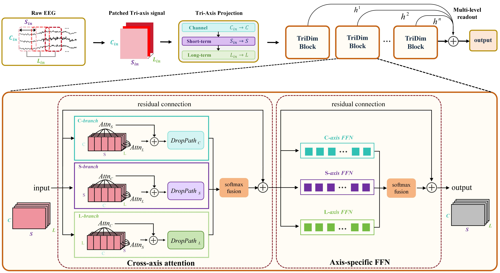

# TriDim

Code and archived experimental results for **Beyond Flattened Tokens: Structure-Preserving EEG Decoding with Reusable TriDim Blocks**.

TriDim preserves three complementary axes of EEG signals: **channels (C)**, **short-term structure within each patch (S)**, and **long-term structure across patches (L)**. This repository provides the supervised **Full model** and TriDim pretraining integrations for **CBraMod, CSBrain, and REVE**.

[](assets/workflow.jpg)

*TriDim overview. EEG signals are organized into patches and projected along the three axes. Each TriDim block combines cross-axis attention, dimension-specific stochastic depth, and axis-specific feed-forward networks through learned softmax fusion. Multi-level readout aggregates representations from multiple blocks for prediction. Click the figure to view it at full resolution.*

The supervised Full benchmark reports **57.70% average accuracy across eight datasets**, using **three seeds (5, 42, and 43)** and a nominal **8:1:1 train/validation/test split**. Pretraining integrations are separate experiments.

## What is included

| Component | Contents |
|---|---|
| Supervised Full model | Model implementation, training code, eight dataset configurations, and a launcher for the 24 paper runs |
| Data preparation | Converters for eight downstream datasets, channel coordinates, and six fixed split manifests for SEED-V and SleepEDF |
| Archived Full results | 24 per-seed log sections, machine-readable metrics, and result/file-hash verification |
| Pretraining | CBraMod+TriDim, CSBrain+TriDim, and REVE+TriDim integration code, pinned upstream revisions, and TUH2k presets |
| Pretraining evidence | Archived convergence data, source notes, and checkpoint size/hash metadata |

Raw EEG recordings and checkpoint binaries are not included. See the linked protocol and pretraining documentation for the scope of each experiment.

<details>
<summary><strong>Repository layout</strong></summary>

```text
TriDim_model/
├── assets/              # Method overview figure
├── configs/
│   ├── paper/full/      # Eight Full model configurations
│   ├── electrodes/      # Channel coordinates
│   └── splits/          # Fixed split manifests
├── data/                # Dataset metadata and preparation notes
├── data_provider/       # Training data loaders
├── exp/                 # Training and evaluation loops
├── models/tridim.py     # Supervised Full model
├── preprocessing/       # Eight downstream dataset converters
├── logs/full/           # 24 archived Full log sections
├── reported/            # Per-run metrics, summary, and protocol
├── scripts/             # Full launcher and verification scripts
├── pretraining/
│   ├── configs/         # Three TUH2k presets
│   ├── overlays/        # TriDim integration source
│   ├── evidence/        # Convergence data and checkpoint metadata
│   ├── licenses/        # Retained third-party license texts
│   ├── prepare_upstreams.py
│   ├── run.py
│   ├── smoke_test.py
│   └── verify.py
├── utils/
├── run.py
├── requirements.txt
├── requirements-runtime.txt
├── PAPER_PROTOCOL.md
└── VALIDATION.md
```

</details>

## Paper Full results

Archived test accuracies are reported as **mean ± sample standard deviation** over seeds **5, 42, and 43**. Each run selects its checkpoint using **validation accuracy**, followed by held-out test evaluation.

| Dataset | Accuracy (%) |
|---|---:|
| AD65 | 63.83 ± 6.10 |
| SleepEDF | 85.61 ± 2.19 |
| BCI-IV-2A | 56.60 ± 2.71 |
| SHU-MI | 60.20 ± 7.16 |
| PhysioNet-MI | 60.43 ± 8.00 |
| FACED | 53.04 ± 2.87 |
| SEED | 52.87 ± 2.22 |
| SEED-V | 29.04 ± 4.34 |
| **Eight-dataset macro average** | **57.70** |

The macro average gives equal weight to each dataset mean; samples are not pooled across datasets. Comparisons require the same dataset set and evaluation protocol. Details are provided in the [paper protocol](PAPER_PROTOCOL.md) and [data preparation notes](data/README.md).

Recompute the archived table and verify its source logs using Python, without installing PyTorch or downloading EEG data:

```bash
python scripts/verify_reported_results.py
```

See the [24 run records](reported/full_24_runs.json), [result summary](reported/full_summary.csv), and [Full logs](logs/full/). The logs are retained, sanitized sections from historical runs, not new training output generated during repository preparation.

## Installation

The training commands below target **Linux with NVIDIA GPUs**. Use **Python 3.11** and a **PyTorch 2.4.1** build compatible with your CUDA environment.

```bash
git clone https://github.com/ncclab-sustech/TriDim_model.git
cd TriDim_model

python3.11 -m venv .venv
source .venv/bin/activate
pip install -r requirements.txt
```

If a suitable PyTorch 2.4.1 build is already installed, install the remaining runtime dependencies instead:

```bash
pip install -r requirements-runtime.txt
```

Check the supervised model's forward and backward passes on synthetic CPU inputs:

```bash
python scripts/smoke_test_models.py
```

## Prepare downstream data

Obtain each dataset from its original distributor. The supplied converters produce Zarr signals, sample indices, label mappings, and conversion summaries. See [preprocessing/README.md](preprocessing/README.md) for dependencies and conversion commands.

Set the parent directory containing the prepared datasets:

```bash
export TRIDIM_DATA_ROOT=/path/to/preprocessed/eeg
```

The Full configurations expect the following directories beneath this parent:

| Dataset | Launcher identifier | Directory |
|---|---|---|
| AD65 | `AD65` | `AD65_wsn` |
| SleepEDF | `SleepEDF_full` | `SleepEDF_full` |
| BCI-IV-2A | `BCIC2A` | `BCIC2A_wsn` |
| SHU-MI | `SHU` | `SHU_MI` |
| PhysioNet-MI | `Physionet_MI` | `Physionet_MI_wsn` |
| FACED | `FACED_new` | `FACED_new` |
| SEED | `SEED` | `SEED` |
| SEED-V | `SEED_V` | `SEED_V_10s` |

Data dimensions and counts are listed in [data/datasets.csv](data/datasets.csv). Follow the [paper protocol](PAPER_PROTOCOL.md) when preparing data for the supplied configurations and split manifests.

## Run the supervised Full benchmark

The Full model identifier is **`tridim`**. The [paper configurations](configs/paper/full/) and [machine-readable protocol](reported/protocol.json) define the evaluation settings. Run the commands below from the repository root.

Preview all eight datasets × three seeds without launching training:

```bash
python scripts/run_full_paper.py --gpus 0 1 2 3 --dry-run
```

Run all 24 jobs on four allocated GPUs:

```bash
python scripts/run_full_paper.py --gpus 0 1 2 3
```

The launcher runs **four independent single-GPU jobs concurrently**. It does not distribute one Full model run across four GPUs. On a cluster, invoke it inside an allocated GPU job and use the device identifiers available in that allocation.

To run one dataset with all three paper seeds:

```bash
python scripts/run_full_paper.py --datasets AD65 --gpus 0
```

Each dataset/seed combination receives an isolated working directory under `runs/<timestamp>/`, containing the effective `config.yaml`, `command.json`, `train.log`, `exit_code.txt`, and training outputs. Use `--output-dir /path/to/new/run-directory` to select a destination that does not already exist.

## TriDim pretraining

The [pretraining package](pretraining/README.md) integrates TriDim with CBraMod, CSBrain, and REVE. It provides local source overlays and retrieves the exact upstream revisions recorded in [upstream.json](pretraining/upstream.json).

After installing PyTorch in a Python 3.11 environment, run the following from the repository root:

```bash
pip install -r pretraining/requirements.txt
python pretraining/prepare_upstreams.py
python pretraining/verify.py
python pretraining/smoke_test.py
```

Preparation creates `pretraining/upstream/` and refuses to overwrite existing upstream directories. The smoke checks use reduced synthetic inputs to verify finite masked-reconstruction losses and gradients.

### Input format and retained presets

Pretraining expects prepared TUH H5 data with **21 channels**, a **200 Hz** sampling rate, and **6,000-point windows**. The retained format uses `sub_*.h5` files with EEG under `trial_*/segment_*/eeg`. This input is separate from the downstream Zarr format. See the [pretraining notes](pretraining/README.md) for data selection and source provenance.

| Integration | GPU processes | Batch per process | Epochs | Mask ratio |
|---|---:|---:|---:|---:|
| CBraMod+TriDim | 1 | 128 | 40 | 0.50 |
| CSBrain+TriDim | 4 | 64 | 40 | 0.50 |
| REVE+TriDim | 4 | 16 | 40 | 0.55 |

### Launch pretraining

Preview the effective commands:

```bash
python pretraining/run.py --family cbramod --data-root /path/to/TUH2k_h5 --dry-run
python pretraining/run.py --family csbrain --data-root /path/to/TUH2k_h5 --dry-run
python pretraining/run.py --family reve --data-root /path/to/TUH2k_h5 --dry-run
```

Remove `--dry-run` to train, for example:

```bash
python pretraining/run.py --family csbrain --data-root /path/to/TUH2k_h5
```

Use `--gpus 0 1 2 3` to override the device list. Changing the number of GPUs changes the global batch size and therefore changes the retained training setting.

Outputs are saved under `runs/pretraining/<family>/<timestamp>/`, including `launch.json`, `train.log`, checkpoints, and `exit_code.txt`. A unified workflow from these pretraining presets to downstream fine-tuning evaluation is not yet included.

## Third-party code and data

See the [third-party notices](pretraining/THIRD_PARTY_NOTICES.md) for pinned upstream projects and retained license information. Dataset access and redistribution are governed by the original distributors' terms. This README does not introduce a repository-wide license grant.
